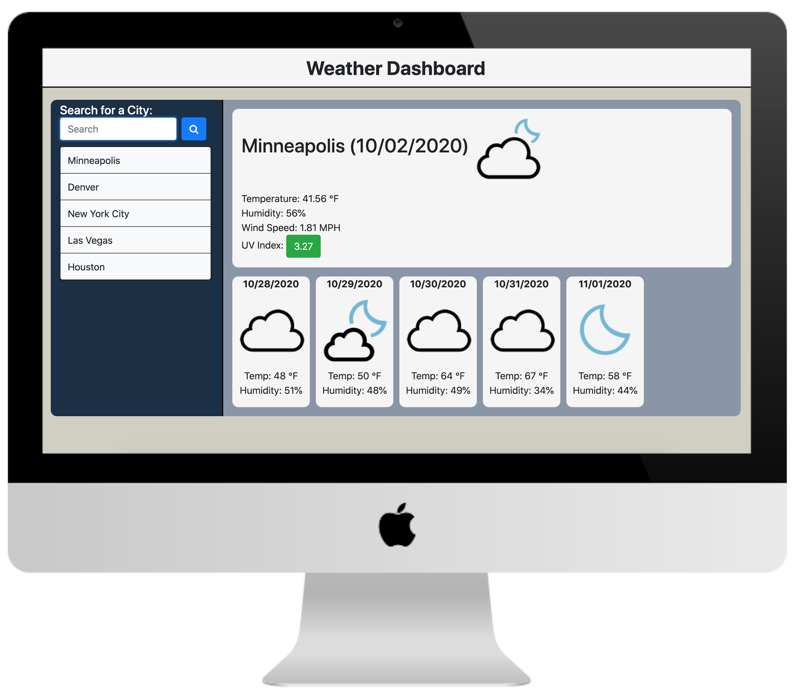

# Weather dashboard

## About this project
The purpose of this project was to create a weather dashboard utilizing the OpenWeather API. The user can search for a city to display the current weather and five day forecast. The UV index will be colorized by severity. Search history will be stored below the search bar in the form of buttons that the user may click to recall search results for that term. On load, the app will clear the search history and display the last search results. If no last search is available, the app will display a welcome message. 

## Deployed link
https://josh8903.github.io/06-weather-dashboard/

## Key implementations
* jQuery
* Moment.js
* Local storage
* AJAX
* OpenWeather API

## Future development
* Add clear and save all feature
* Add time display to date
* Add feature to alter start and end times
* Add feature to change time block incrementation 
* Add a dynamic element to visually indicate current time by minute
* Add feature to save button to indicate if current text field is saved

- - -
Josh Thorngren
